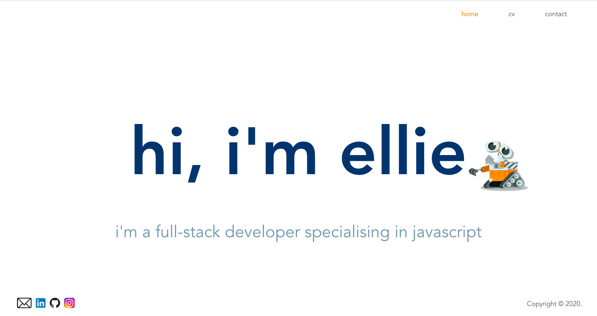

# personal-website

This is the repository for the front-end of my personal website.

You can find my back-end repository here: [https://github.com/elliefairholm/personal-website-server](https://github.com/elliefairholm/personal-website-server).

I learnt Vue.js in less than a week for this project, and hope to use this website to keep track of my progress as a Full-Stack Software Engineer.

<p align="center">
    
</p>


## Getting Started

1. Clone the repository:
```
git clone https://github.com/elliefairholm/personal-website
```
2. Install the dependencies:
```
npm install
```
3. Run the client:
```
npm run serve
```
4. Run the linter:
```
npm run lint
```

## Tech Stack

- [Vue.js](https://vuejs.org/)


## Contributing

This is currently the MVP for the website, and ongoing changes will be being made. However, if you have any questions/comments just drop me an email at <elliefairholm@gmail.com>, or feel free to make a pull request.

Enjoy :)
